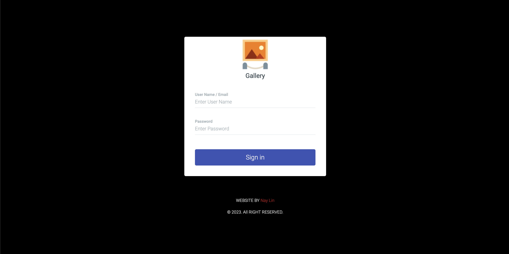
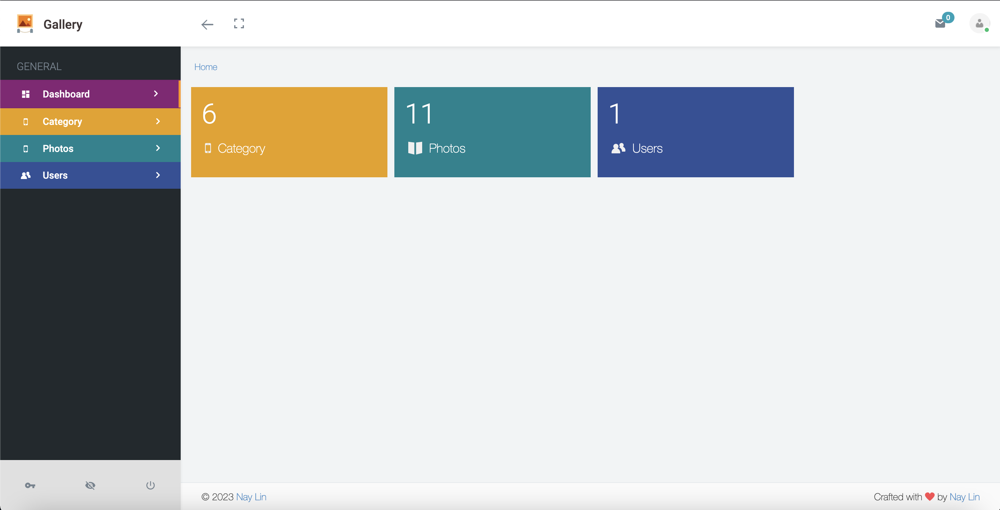
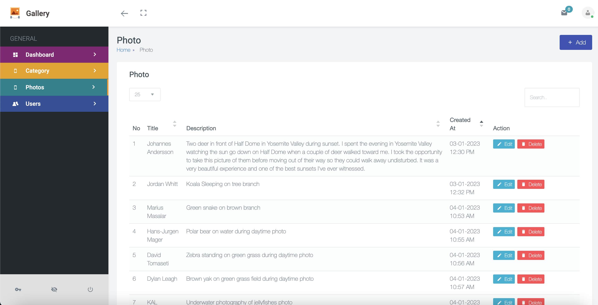

#Gallery Backend with Laravel
It's sample project which is written with SwiftUI.

#Screenshot
Login          |  Dashboard     |  Photo
:-------------------------:|:-------------------------:|:-------------------------:
  |   |  

#Author
Nay Lin - @naylinndev on GitHub
